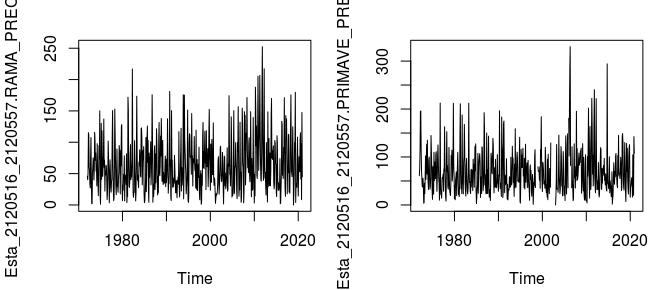

# Taller de Homogenización de Series de Tiempo usando R - AtmosCol 2023

[](https://zenodo.org/doi/10.5281/zenodo.10020141)

## Introducción

Cuando se analizan las series de tiempo climáticas, en particular, la de precipitación, constituye un elemento climático (Eslava, 1999; Jaramillo, 2005), en dichas series se pueden detectar heterogeneidades relacionadas con cambios en la ubicación de la estación, posibles fallas en los instrumentos de medición o de transmisión, u otro tipo de errores en los datos. Es por ello que los diversos tipos de usuarios de datos de variables climáticas requieren realizar un análisis encaminado a la calidad de los datos. Así cuando se hace referencia a la homogenización de series de tiempo, lo que se desea es lograr series que posean una coherencia temática, espacial y temporal. 

El taller tiene como objetivo presentar la metodología de homogenización de series de tiempo de precipitación, que incluye las siguientes etapas (Bernal et al., 2012; Lombana et al., 2018): i) identificación de estaciones meteorológicas vecinas, ii) definir la estación de análisis y estación de referencia, iii) detección de puntos de cambio en el promedio y iv) ajuste de la serie de análisis, precisamente,  se le denomina homogenización de las series, siempre y cuando sea necesario realizarlo, pues es probable detectar heterogeneidades que no constituyen errores en los datos, pues las heterogeneidades, pueden detectar datos particulares en la serie o un tramo de la serie que corresponden al efecto de fenómenos meteorológicos o climáticos, por ejemplo, en la escala de la variabilidad climática interanual, la ocurrencia de eventos El Niño o La Niña generan un efecto temporal en la precipitación, que se pueden analizar con estudio de las anomalías (Pabón y Montealegre, 2017), por lo tanto, se puede señalar que sólo se realizará la homogenización siempre que se detecten errores en los datos, en este contexto, el contraste y la comparación de la serie de análisis con otra (s) estaciones de referencia resulta importante, pues ello permite que las series comparadas guarden una coherencia entre ellas. 

## Autores

Néstor Ricardo Bernal Suárez - Grupo de Investigación GIIAUD, Ingeniería Ambiental, Universidad Distrital Francisco José de Caldas.

José Daniel Pabón Caicedo - Grupo Tiempo, Clima y Sociedad, Departamento de Geografía, Universidad Nacional de Colombia

## Casos de Estudio

Se ilustran tres estudios de caso empleando las series de tiempo mensuales de precipitación de la red hidrometeorológica del Instituto de Hidrología, Meteorología y Estudios Ambientales (IDEAM) en Colombia (Sur América). El primer caso, corresponde a la región de la Sabana de Bogotá, el segundo en la región del Bajo Magdalena, para estos primeros casos se emplea la curva de dobles masas (Barrero y Sabogal (s.f.); Montealegre, 1990); y el tercero en la región del Alto Cauca, para este caso, se emplea como estación de referencia, la serie de tiempo de precipitación de GPCC (Scheiner et al., 2022) y se ilustra el script en el software R-Studio para ilustrar de forma general la metodología de homogenización. El enfoque metodológico que se presenta tiene similitudes y aportes con el desarrollo de Mesa et al., 1997; Henríquez, 2012; Martínez et al., 1996 y Nieto y Ruíz, 2002.



**Figura**: Estación meteorológica de referencia: 2120516 (izquierda) y estación meteorológica de análisis: 2120557 (derecha).

### Estructura

|        Hora         |                             Contenido                              |     Tutor     | Duración  |
| :-----------------: | :----------------------------------------------------------------: | :-----------: | :-------: |
| 01:30 PM - 03:00 PM | Homogenización de series de tiempo mensuales de precipitación en R | Néstor Bernal | 1.5 horas |
 

### Ejecutar de manera local

Si está interesado en ejecutar este material localmente en su computadora, deberá seguir este flujo de trabajo:

1. Clone el repositorio `https://github.com/nrbernals/Homogenizacion_series.git` usando el siguiente comando de consola:

   ```bash
    git clone https://github.com/nrbernals/Homogenizacion_series.git
   ```

1. Entre en la carpeta de `Homogenizacion_series`
   ```bash
   cd Homogenizacion_series
   ```

1. Vaya a la carpeta `src` y comience una sesión de `RStudio`
   ```bash
   cd src/
   rstudio
   ```

Los cógigos aquí contenidos se escribieron en R-Studio versión 3.6 y requieren de los siguientes paquetes para su correcto funcionamiento: i) tidyverse, ii) lubridate, iii) TSstudio, iv) COR,  v) dplyr, vi) trend, vii) xlsx y viii) SPEI

## Agradecimientos 

Al Instituto de Hidrología, Meteorología y Estudios Ambientales (IDEAM), a Ruth Correa y María Inés Cubillos de la Subdirección de Meteorología.
